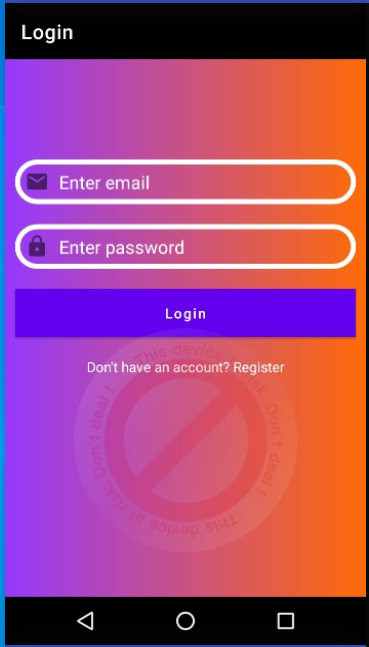
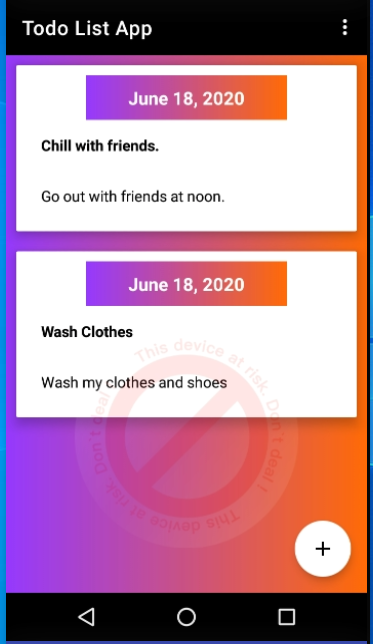
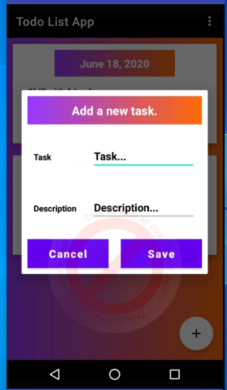
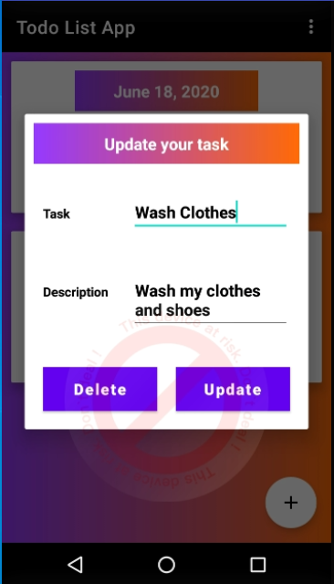

# ToDo-List-Android-App

A ToDo List Mobile Application using Java and Firebase.

The UI designs look like this:

# Login Page

# Main Page to display the List of Activities

# Alert Dialog to allow one to add a task

# Alert dialog to allow one to update or delete an existing task

